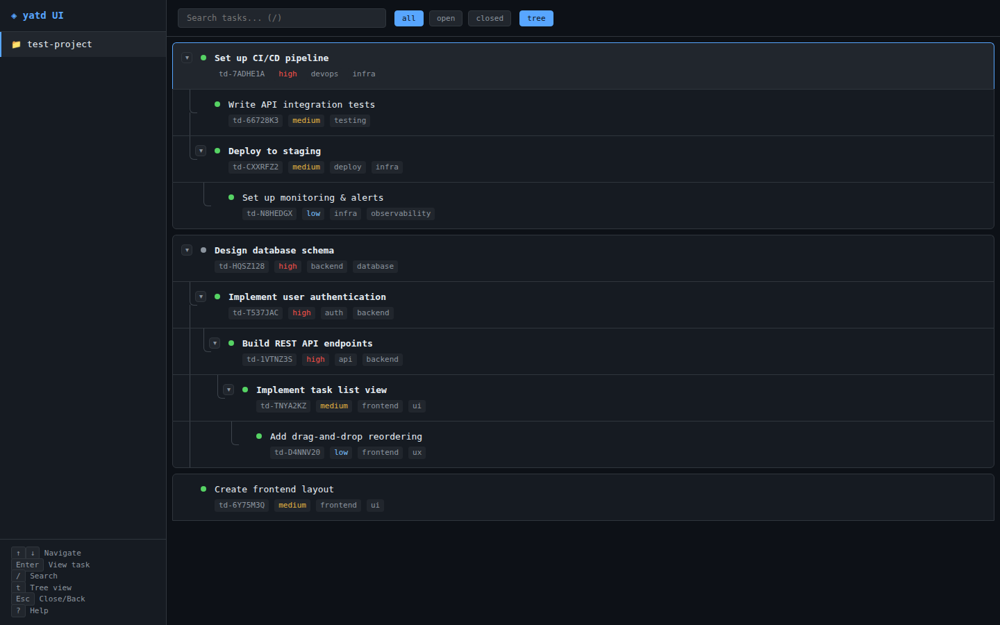

# yatd UI

A minimal, fast, TUI-inspired web interface for [yatd](https://github.com/kaantiny/yatd) - the CLI todo manager.



## Features

- **Project browsing** - View all your yatd projects
- **Task list** - See all tasks with status indicators, labels, and dependencies
- **Task details** - Full task view including description, labels, dependencies, work log, and timestamps
- **Search** - Real-time search by title, description, or task ID
- **Filters** - Filter by status (all/open/closed)
- **Keyboard navigation** - Full keyboard support for power users

## Keyboard Shortcuts

| Key | Action |
|-----|--------|
| `↑` / `↓` or `k` / `j` | Navigate tasks |
| `Enter` | View task details |
| `Esc` | Close detail panel |
| `/` | Focus search box |
| `o` | Show open tasks only |
| `c` | Show closed tasks only |
| `a` | Show all tasks |
| `r` | Refresh data |
| `?` | Toggle help |

## Installation

### From release (recommended)

Download the latest binary from [Releases](https://github.com/kaantiny/yatd-ui/releases):

```bash
# Download the latest release (replace with your OS/arch)
curl -L -o yatd-ui https://github.com/kaantiny/yatd-ui/releases/latest/download/yatd-ui-linux-amd64
chmod +x yatd-ui
./yatd-ui
```

### From source

```bash
git clone https://github.com/kaantiny/yatd-ui.git
cd yatd-ui
go build -o yatd-ui .
./yatd-ui
```

### As a systemd service

```bash
sudo cp yatd-ui /usr/local/bin/
sudo cp yatd-ui.service /etc/systemd/system/
sudo systemctl daemon-reload
sudo systemctl enable --now yatd-ui
```

## Configuration

The server listens on port 8080 by default. Set the `PORT` environment variable to change:

```bash
PORT=8080 ./yatd-ui
```

## Design

- **TUI-inspired** - Dark theme with monospace fonts, minimal chrome
- **Fast** - Single binary, no dependencies, loads instantly
- **Keyboard-first** - All actions accessible via keyboard shortcuts
- **Extensible** - Easy to add new keyboard shortcuts and features

## Version

Print version:

```bash
./yatd-ui --version
```

Release builds embed the GitHub tag (for example `v0.1.2`). Local/source builds without linker flags show `dev`.
